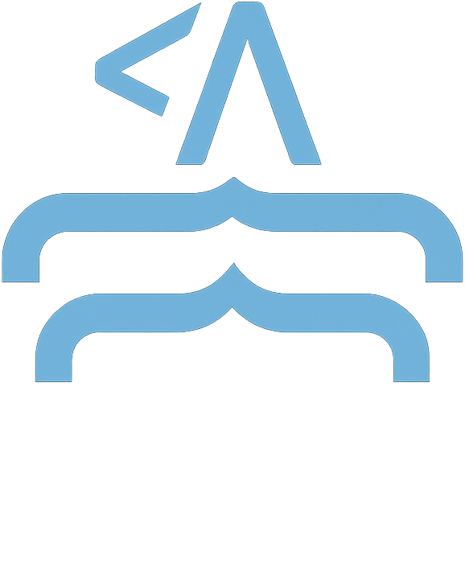
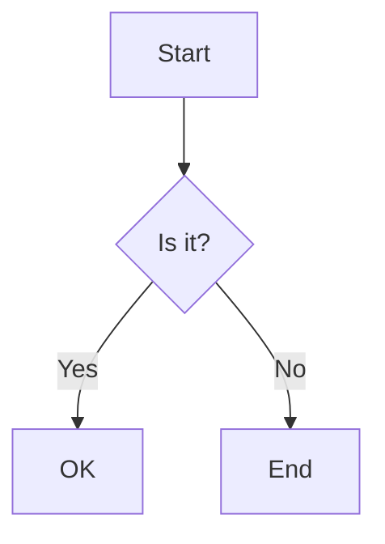

# MerMDitor - Markdown Editor with Mermaid Support

A lightweight, modern Markdown editor built with Vue 3 and Tailwind CSS that allows you to write and preview Markdown content in real-time. It features special support for Mermaid diagrams, syntax highlighting, and a clean, distraction-free editing experience.



## ✨ Features

- 📝 **Real-time Markdown Preview**: See your formatted content as you type
- 📊 **Mermaid Diagram Support**: Create flowcharts, sequence diagrams, and more with Mermaid syntax
- 🎨 **Syntax Highlighting**: Automatic code block highlighting for various languages
- 🔄 **Resizable Panels**: Adjust the editor and preview panel sizes to your preference
- 📊 **Word Count**: Track your document's length with real-time word and character counting

## 🔧 Tech Stack

- 🖼️ **Vue 3**: Progressive JavaScript framework for building modern UI
- 🎨 **Tailwind CSS**: Utility-first CSS framework for rapid UI development
- 📝 **markdown-it**: Powerful Markdown parser
- 📊 **Mermaid**: JavaScript-based diagramming and charting tool
- ✨ **highlight.js**: Syntax highlighting for code blocks
- ⚡ **Vite**: Next generation frontend tooling for fast development

## 💿 Getting Started

Follow these steps to set up the project locally:

### Prerequisites

- Node.js (v16.0.0 or higher)
- npm or another package manager

### Installation

1. Clone the repository:
   ```bash
   git clone https://github.com/yourusername/mdit.git
   cd mdit
   ```

2. Install dependencies:
   ```bash
   npm install
   ```

3. Start the development server:
   ```bash
   npm run dev
   ```

4. Open your browser and visit:
   ```
   http://localhost:3000
   ```

## 💡 Usage Guide

### Basic Usage

1. **Writing Markdown**: Type your markdown content in the left panel
2. **Real-time Preview**: See the rendered output in the right panel as you type
3. **Panel Resizing**: Drag the divider between panels to adjust their width
4. **Auto-save**: Your content is automatically saved to localStorage

### Keyboard Shortcuts

| Action | Shortcut |
|--------|----------|
| Bold text | <kbd>Ctrl</kbd> + <kbd>B</kbd> |
| Italic text | <kbd>Ctrl</kbd> + <kbd>I</kbd> |
| Insert link | <kbd>Ctrl</kbd> + <kbd>K</kbd> |
| Insert heading | <kbd>Ctrl</kbd> + <kbd>Shift</kbd> + <kbd>1</kbd> |
| Save manually | <kbd>Ctrl</kbd> + <kbd>S</kbd> |

### Mermaid Diagram Syntax

Create diagrams by using the Mermaid syntax within code blocks:

````markdown

````

### Building for Production

To build the project for production:

```bash
npm run build
```

The built files will be in the `dist` directory.

## 🧩 Project Structure

```
src/
  ├── components/                # Vue components
  │   ├── MarkdownEditor.vue     # Main editor component
  │   └── MermaidRenderer.vue    # Mermaid diagram renderer
  ├── plugins/                   # Plugin configurations
  │   ├── markdownItHighlight.ts # Code syntax highlighting
  │   ├── markdownItMermaid.ts   # Mermaid diagram processing
  │   └── mermaid.ts            # Mermaid configuration
  └── styles/                    
      └── tailwind.css          # Tailwind CSS configuration
```

## 🤝 Contributing

Contributions are welcome! Feel free to:

1. Fork the repository
2. Create your feature branch: `git checkout -b feature/amazing-feature`
3. Commit your changes: `git commit -m 'Add some amazing feature'`
4. Push to the branch: `git push origin feature/amazing-feature`
5. Open a Pull Request

## 📑 License

[MIT](http://opensource.org/licenses/MIT)

Copyright (c) 2025 MerMDitor Team
